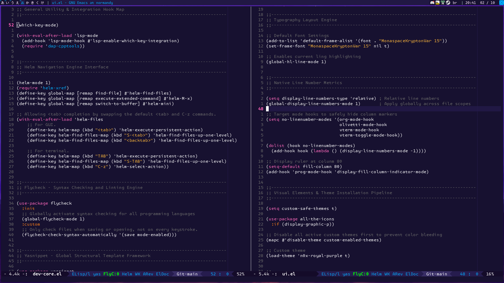
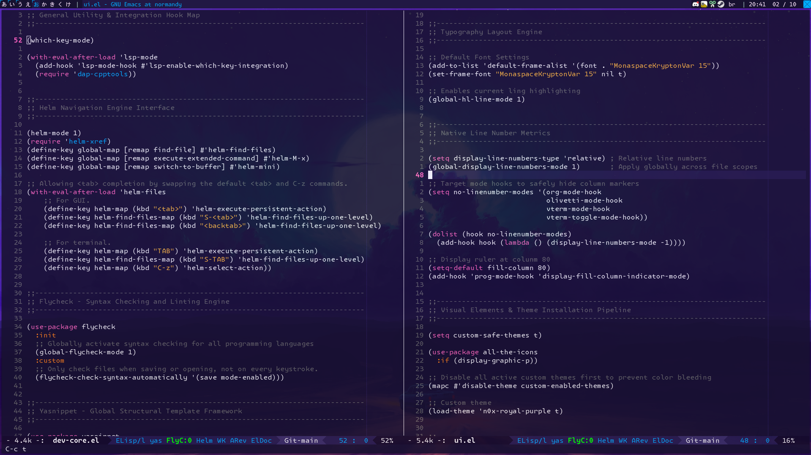

# Installation
This configuration was created on a freshly built Emacs v30.1 with the following steps:
``` sh
$ yay -S base-devel cmake clang ccls libgccjit tree-sitter

$ mkdir -p ~/.local/src/emacs
$ cd ~/.local/src/emacs

$ curl -LO http://mirror.rit.edu/gnu/emacs/emacs-30.1.tar.gz
$ tar xzf emacs-30.1.tar.gz
$ cd emacs-30.1/

$ ./configure --prefix=$HOME/.local \
--with-xft \
--with-native-compilation=aot \
--with-tree-sitter \
--with-mailutils \
--with-x-toolkit=lucid \
CFLAGS="-O2 -pipe -march=native -fomit-frame-pointer"

$ make
$ make install

$ cd ..
$ rm emacs-30.1.tar.gz

# Then clone this configuration to the correct path

$ mkdir -p ~/.emacs.d/
$ cd ~/.emacs.d/
$ git clone https://github.com/n0xeris/emacs.d.git .
```

Then inside `~/.zshenv` add those lines to setup emacs as a server/client application:
```sh
# local user bins
export PATH="$PATH:$HOME/.local/bin:$HOME/.bin"

# Emacs utils
alias emacs="emacsclient -c"
alias emacst="emacsclient -c -nw"

alias emacs-start="~/.local/bin/emacs --daemon"
alias emacs-kill="killall emacs"
alias emacs-reset="emacs-kill && emacs-start"
```

Finally, start the server with `emacs-start` and open the client via `emacs`.


# Screenshots
Transparency changes when Emacs is in and out of focus, and can also be toggled manually (`C-c t`).

| In Focus (Opaque)                    | Out of Focus (Translucid)                |
|--------------------------------------|------------------------------------------|
|  |  |


# Details
The font used comes from the package:
```sh
$ yay -S ttf-monaspace-variable
```

The directory for the `org-roam` package must exist before we run it the first time, so we create it along the directory for other `.org` documents:
```sh
$ mkdir -p ~/.org/journal/daily ~/.org/docs
```
# Dependencies
For C/C++ development, the dependencies installed to compile Emacs should be enough, but other languages still require a little more work. Here are the dependencies for other languages.

## Zig
```sh
# manually installing zig
mkdir -p ~/.local/src/zig
cd ~/.local/src/zig

wget https://ziglang.org/builds/zig-x86_64-linux-0.17.0.tar.xz
tar -xf zig-x86_64-linux-0.17.0.tar.xz
rm zig-x86_64-linux-0.17.0.tar.xz

# installing zls (language server)
yay -S zls
```

Then add this to `~/.zshenv`:
```sh
export PATH="$PATH:$HOME/.local/src/zig/zig-x86_64-linux-0.17.0"
```

## Rust
The `lsp` integration with `rust` also has a couple dependencies:
```sh
$ curl --proto '=https' --tlsv1.2 -sSf https://sh.rustup.rs | sh

$ rustup default stable
$ rustup component add rust-src
$ rustup component add clippy
$ rustup component add rustfmt
$ rustup component add rust-analyzer
```

## Haskell
Install `GHCup` to manage the `Haskell` toolchain:
```sh
curl --proto '=https' --tlsv1.2 -sSf https://get-ghcup.haskell.org | sh
# Base Channel?                 [G] GHCup maintained
# Cross Channel?                [N] No
# 3rd Party Channel?            [Y] Yes
# Add ghcup to PATH?            [A] Yes, append
# Do you want to install HLS?   [Y] Yes
```

## Golang
```sh
yay -S go

# Install the official Go language server
go install golang.org/x/tools/gopls@latest

# Install goimports to automatically format code and manage imports on save
go install golang.org/x/tools/cmd/goimports@latest
```

Add the environment variables to `~/.zshenv`:
```sh
export GOPATH="$HOME/.go"
export GOPROXY="direct"
export PATH="$PATH:$GOPATH/bin"
```
